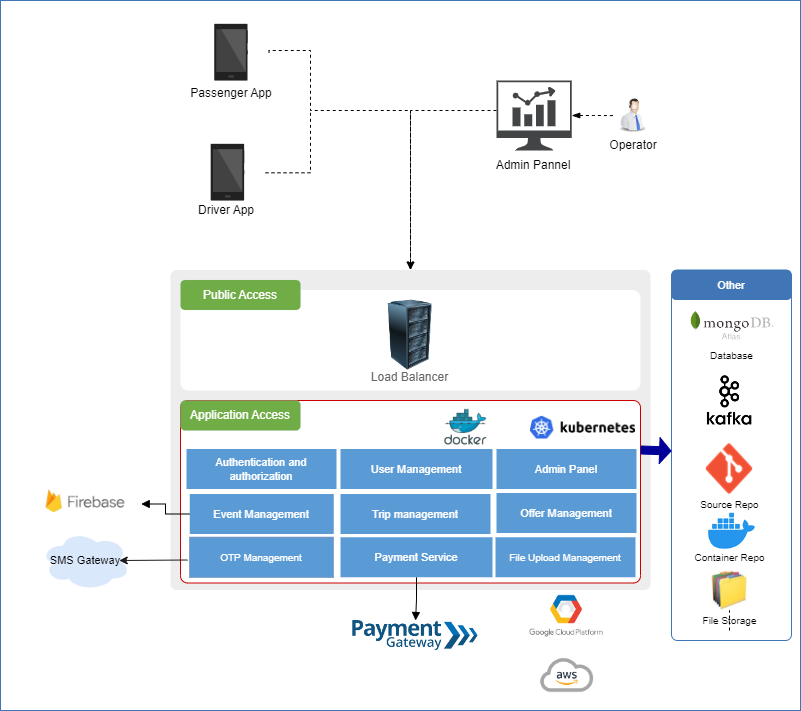

# Ride Sharing Application

Comprehensive ride-sharing system encompassing customer and driver applications, complemented by an administrative portal. This multifaceted solution enables customers to initiate rides, prompting nearby drivers for swift pickups. Leveraging a hybrid architecture that amalgamates event-driven and data-driven paradigms, I harnessed microservices for implementation. The event-driven facet seamlessly integrates Kafka, facilitating near real-time trip processing and accommodating higher throughput. The system interfaces with external solutions such as Firebase, MongoDB Atlas, payment gateways, and SMS gateways. Deployment was accomplished across AWS EKS and GCP GKE clusters, utilizing Docker and Kubernetes. A strategic trajectory involves the integration of a monitoring system harmonized with Kubernetes, alongside the implementation of the EFK stack for enhanced observability and analysis. 

This is the main front facing microservice in whole architecture. This will perform user authentication and authorization based on JWT and perform traffic forwarding to inner microservices based on authorization level and destination URI 

## Overall System Features

* Implemented an OTP service featuring SMS sending capability to facilitate secure user authentication.
* Leveraged an event-driven approach through Kafka cluster for seamless near real-time data processing.
Engineered robust trip management and geolocation processing functionalities.
* Developed systems for personalized and public offer, as well as event management.
* Ensured effective system control via an intuitive admin portal.
* Designed and integrated file upload mechanisms with user management, incorporating rigorous authentication and authorization protocols.
* Enabling secure and efficient online payments through VISA and MasterCard integration.

## Supported versions

system will supports the following versions.  
Other versions might also work, but we have not tested it.

* Java 8, 11
* Spring Boot 2.7.5

## High Level Architecture

## Contributing

Bug reports and pull requests are welcome :)